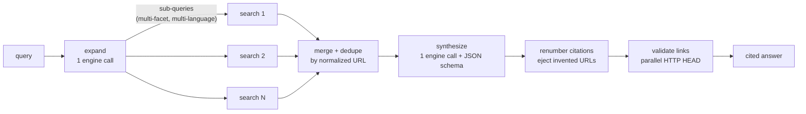

# ▲ muaddib

> The one who points the way. Every claim, sourced.

[](https://github.com/guisolski/muaddib/actions/workflows/ci.yml)
[](LICENSE)
[](Cargo.toml)

```
       \ /
      (o.o)~-,
      (_)(_)
    ﹏﹏﹏▲﹏﹏﹏
```

**muaddib** is an AI-powered meta-search engine that lives in your terminal.
Type a question, and muaddib expands it into multiple sub-queries — across
facets *and* languages — runs them in parallel through the AI CLI you already
have installed, and compiles one synthesized answer where **every claim carries
a verified source link**.

## Why "muaddib"?

In *Dune*, the muad'dib is the desert kangaroo mouse — the Fremen admire it
because it survives the deep desert and creates its own water, and the
constellation named after it is called **"the one who points the way"**. That
is the whole job of a search engine. The little mouse is the TUI's mascot: it
sleeps on the dunes while you type, hops across them while your search fans
out, and celebrates when the answer lands. Sit idle long enough and Shai-Hulud
passes through.

The project was previously named **faro** (Portuguese for a scent-tracking
instinct) — the mouse kept the nose.

```
                                  \ /
                                 (o.o)~-,
                                 (_)(_)
                                ﹏﹏﹏▲﹏﹏﹏
                                  muaddib

                ╭──────────────────────────────────────╮
                │ why is the sky blue?                 │
                ╰──────────────────────────────────────╯
                 General · Scientific · News · Deep
                             ⚡ fast

                        claude ● · default · pt-BR
    Enter search · ↑ history · Tab mode · Ctrl+O config · Ctrl+G help
```

## Why use it?

- **It searches beyond your words.** Your query is expanded into distinct facets and
  translated variants (the topic's origin language, English, …), so the answer draws
  from sources a literal search would never reach.
- **Every claim is cited.** The answer is a structured document where each paragraph,
  list item, table, and chart references numbered sources. URLs that don't come from
  the actual searches are ejected, and every link is health-checked (HTTP HEAD) live.
- **No API keys.** muaddib drives the AI CLIs you already use — `claude`, `cursor-agent`,
  `codex`, `opencode` — as subprocesses, reusing their auth and their built-in web
  search. The built-in web-search grounding is keyless too: it only uses open
  endpoints and public APIs.
- **Grounded in real indexes.** Before the AI fans out, each sub-query also runs
  against conventional search engines (DuckDuckGo, Bing, Mojeek) and — in
  Scientific mode — scholarly APIs (OpenAlex, Crossref, Semantic Scholar). The
  pooled hits are reranked with BM25, handed to the AI as candidate sources to
  verify and cite, and in Scientific and Deep modes the top pages are fetched
  and their readable text fed to the searches.
- **Research grows as a tree.** Ask a follow-up (`f`) and it branches from the
  answer you are reading, carrying the questions, answers, and sources of the
  path so far into the next search. Navigate the tree (`t`), revisit any node,
  branch again from anywhere, and save the whole session to disk (`s`) to
  reopen later with `--session`.
- **Fast and light.** A single small Rust binary. Sub-searches fan out concurrently
  with bounded parallelism; the UI stays at 60fps-smooth 100ms ticks; Esc cancels
  everything and reaps child processes instantly.

## Features

- Minimalist TUI: one centered search bar, six focus modes (`General`, `Scientific`,
  `News`, `Code`, `Forums`, `Deep`) — `Code` biases the web search toward
  documentation and repositories, `Forums` toward what practitioners actually report
- Multilingual query expansion with a deterministic offline fallback
- Built-in web-search grounding, in-binary and keyless: candidate results from
  DuckDuckGo, Bing, and Mojeek — plus OpenAlex, Crossref, and Semantic Scholar in
  Scientific mode — are BM25-reranked, then verified and cited by the AI;
  degrades silently and can be disabled with `--no-websearch`
- Page-content grounding in Scientific and Deep modes: the top hits' pages are
  fetched and boiled down to readable text that grounds each sub-search
  (`[websearch] ground_modes`)
- Follow-up searches that build a navigable research tree: branch from any
  answer with `f`, explore with `t`, save the session with `s`, reopen with
  `--session <file>`
- Fast mode (`Ctrl+F` / `--fast`): one engine call instead of three, with a small
  model and a trimmed answer schema — ~5x faster on real queries (31s vs 166s
  measured on `claude`+`haiku`), and combines with any search mode
- Model-decided fast path: simple questions are rated `simple` at expansion and
  run a single search instead of the full fan-out
- Persistent search history: `↑`/`↓` recall past searches like a shell, `Ctrl+L`
  clears it (asks once, then deletes)
- Parallel fan-out with per-sub-query live progress
- Structured answers: headings, paragraphs, lists, quotes, tables, terminal
  bar charts, and flow/timeline diagrams — all cited
- Inline images from the searched pages, rendered in the terminal (kitty,
  iTerm2, sixel — unicode half-blocks everywhere else)
- Live link validation (✓ / ✗ 404) directly in the sources list
- Config modal (`Ctrl+O`): answer language, engine, model, link validation, parallelism
- Headless mode (`--print`) that emits the answer as JSON for scripting
- Answer language follows your config (default: `pt-BR`) — search in any language,
  read in yours

## Requirements

- Rust 1.93+ (to build)
- At least one supported AI CLI on your `PATH`:

| Engine | Binary | Web search | Structured output | Install |
|---|---|---|---|---|
| Claude Code | `claude` | ✓ (WebSearch tool) | ✓ (`--json-schema`) | `npm install -g @anthropic-ai/claude-code` |
| Cursor CLI | `cursor-agent` | model-dependent | prompt-enforced | `curl https://cursor.com/install -fsS \| bash` |
| Codex CLI | `codex` | model-dependent | prompt-enforced | `npm install -g @openai/codex` |
| opencode | `opencode` | model-dependent | prompt-enforced | `npm install -g opencode-ai` |

Engines that are not installed appear greyed out in the config modal; muaddib falls back
to the first available engine automatically.

## Install

**Homebrew** (macOS, Linux):

```sh
brew install guisolski/muaddib/muaddib
```

**Install script** (macOS, Linux — downloads the prebuilt binary and verifies its checksum):

```sh
curl -fsSL https://raw.githubusercontent.com/guisolski/muaddib/main/scripts/install.sh | sh
```

Installs to `~/.local/bin` by default; set `MUADDIB_INSTALL_DIR` to change that, or
`MUADDIB_VERSION` to pin a tag.

**Cargo** (any platform with Rust 1.93+):

```sh
cargo install muaddib
```

**From source**:

```sh
git clone https://github.com/guisolski/muaddib
cd muaddib
make install        # cargo install --path .
```

Prebuilt binaries for macOS (arm64, x86_64) and Linux (x86_64, arm64) are attached to
every [release](https://github.com/guisolski/muaddib/releases), each with a `.sha256`
alongside it.

## Usage

```sh
muaddib                          # open the TUI
muaddib "quantum computing"      # open the TUI and search immediately
muaddib --mode scientific "CRISPR delivery methods"
muaddib --lang en --engine claude "energia solar no brasil"
muaddib --model haiku "capital of australia"   # pass a model to the engine CLI
muaddib --fast "capital of peru"               # one engine call instead of three
muaddib --print "rust 1.93 release highlights" > answer.json   # headless JSON
muaddib --clear-history                        # erase the saved search history
```

### Keybindings

| Scope | Key | Action |
|---|---|---|
| Everywhere | `Ctrl+C` | quit |
| Everywhere | `Ctrl+G` | toggle help |
| Everywhere | `Ctrl+O` | open config |
| Everywhere | `Esc` | back / cancel search / close modal |
| Home | `Enter` | search |
| Home | `Tab` / `Shift+Tab` | cycle search mode |
| Home | `↑` / `↓` | walk the search history (your unsent draft comes back at the end) |
| Home | `Ctrl+L` | clear the whole search history — press once to ask, twice to delete |
| Home, Results | `Ctrl+F` | toggle fast mode |
| Results | `j`/`k`/`↓`/`↑` | scroll, or move the selection in the focused pane |
| Results | `PgDn`/`PgUp`/`g`/`G` | page / top / bottom |
| Results | `Tab` / `Shift+Tab` | cycle focus: body → sources → follow-ups |
| Results | `Enter` | open the selected source, or run the selected follow-up as a new search |
| Results | `1`-`9` | jump to source N |
| Results | `n` | new search |
| Results | `/` | refine current search |
| Results | `q` | quit |

The in-app help (`Ctrl+G`) is generated from the same keymap table, so it never drifts.

## How it works



1. **Expand** — one engine call rates the query's complexity and turns it into up
   to N sub-queries covering distinct facets, including at least one in another
   relevant language. A `simple` rating narrows the plan to a single search, so
   quick factual questions come back fast. If the call fails, a deterministic
   per-mode fallback table keeps the search alive.
2. **Fan-out** — sub-searches run concurrently (`buffer_unordered`, bounded by
   `max_parallel`), each returning claims with exact source URLs and, when a
   page shows a relevant image, its direct image URL.
3. **Merge** — findings are deduplicated by normalized URL + claim.
4. **Synthesize** — one final engine call compiles everything into a structured JSON
   answer in *your* language, validated against a JSON Schema — favoring compact
   visual blocks, including a flow or timeline diagram of the answer's core
   structure, and image blocks for findings worth showing. Sources — and image
   URLs — that never appeared in the findings are ejected (anti-hallucination
   gate) and citations are renumbered in first-use order.
5. **Validate** — every source URL gets a parallel HTTP HEAD check; the sources list
   updates live with ✓ / ✗.
6. **Fetch images** — surviving image URLs are downloaded and drawn in place with
   the best graphics protocol the terminal offers (kitty, iTerm2, sixel), or
   unicode half-blocks as a universal fallback.

Read more in [`docs/`](docs/): [architecture](docs/architecture.md) ·
[engines](docs/engines.md) · [search pipeline](docs/search-pipeline.md) ·
[configuration](docs/configuration.md) · [development](docs/development.md) ·
[ADRs](docs/adr/)

## Configuration

`~/.config/muaddib/config.toml` (or `$XDG_CONFIG_HOME/muaddib/config.toml`, or `$MUADDIB_CONFIG`):

```toml
language = "pt-BR"          # answer language (BCP-47)
engine = "claude"           # claude | cursor-agent | codex | opencode
max_parallel = 4            # concurrent sub-searches (1-8)
expansion_breadth = 0       # 0 = use the mode default
validate_links = true       # HTTP HEAD check on every source
images = true               # fetch and render answer images in the terminal
animations = true           # staggered reveal, chart growth, pulses
engine_timeout_secs = 180
fast_timeout_secs = 45      # ceiling for the single fast-mode call (5-120)

[engines.claude]            # optional per-engine overrides
bin = "/custom/path/claude" # binary path
model = "sonnet"            # model passed to the CLI (any value it accepts)
fast_model = "haiku"        # model used in fast mode
```

Search history lives separately, under the XDG *state* dir:
`~/.local/state/muaddib/history.jsonl` (or `$XDG_STATE_HOME/muaddib/history.jsonl`, or
`$MUADDIB_HISTORY`). It is JSON Lines — one appended object per search, capped at 500
entries, with unparsable lines skipped rather than fatal.

Upgrading from the old **faro** name? Your config and history don't move themselves:

```sh
mv ~/.config/faro ~/.config/muaddib
mv ~/.local/state/faro ~/.local/state/muaddib
```

## Development

```sh
make hooks      # install pre-commit hooks (fmt, clippy, tests, no-comments guard...)
make test       # run the full test suite (fake engine, no network, no AI calls)
make ci         # what CI runs: fmt-check + clippy -D warnings + tests + release build
```

The project follows TDD with table-driven tests, a pure functional core (zero I/O in
`src/core/`), and a no-comments convention — intent lives in named functions and in
`/docs`. See [docs/development.md](docs/development.md).

## Roadmap

- Video results as external links
- Answer cache
- More engines (adding one is a single table row — see [docs/engines.md](docs/engines.md))

## License

[MIT](LICENSE)
