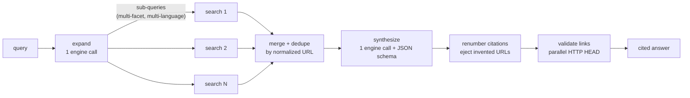

# ▲ faro

> Sniff out answers. Every claim, sourced.

[](https://github.com/guisolski/faro/actions/workflows/ci.yml)
[](LICENSE)
[](Cargo.toml)

**faro** (Portuguese: *"ter faro"* — an instinct for finding things) is an AI-powered
meta-search engine that lives in your terminal. Type a question, and faro expands it
into multiple sub-queries — across facets *and* languages — runs them in parallel
through the AI CLI you already have installed, and compiles one synthesized answer
where **every claim carries a verified source link**.

```
                                ▲ faro

                ╭──────────────────────────────────────╮
                │ why is the sky blue?                 │
                ╰──────────────────────────────────────╯
                 General · Scientific · News · Deep

                        claude ● · default · pt-BR
          Enter search · Tab mode · Ctrl+O config · Ctrl+G help
```

## Why faro?

- **It searches beyond your words.** Your query is expanded into distinct facets and
  translated variants (the topic's origin language, English, …), so the answer draws
  from sources a literal search would never reach.
- **Every claim is cited.** The answer is a structured document where each paragraph,
  list item, table, and chart references numbered sources. URLs that don't come from
  the actual searches are ejected, and every link is health-checked (HTTP HEAD) live.
- **No API keys.** faro drives the AI CLIs you already use — `claude`, `cursor-agent`,
  `codex`, `opencode` — as subprocesses, reusing their auth and their built-in web
  search.
- **Fast and light.** A single small Rust binary. Sub-searches fan out concurrently
  with bounded parallelism; the UI stays at 60fps-smooth 100ms ticks; Esc cancels
  everything and reaps child processes instantly.

## Features

- Minimalist TUI: one centered search bar, four focus modes (`General`, `Scientific`,
  `News`, `Deep`)
- Multilingual query expansion with a deterministic offline fallback
- Model-decided fast path: simple questions are rated `simple` at expansion and
  run a single search instead of the full fan-out
- Parallel fan-out with per-sub-query live progress
- Structured answers: headings, paragraphs, lists, quotes, tables, terminal
  bar charts, and flow/timeline diagrams — all cited
- Inline images from the searched pages, rendered in the terminal (kitty,
  iTerm2, sixel — unicode half-blocks everywhere else)
- Live link validation (✓ / ✗ 404) directly in the sources list
- Config modal (`Ctrl+O`): answer language, engine, model, link validation, parallelism
- Headless mode (`--print`) that emits the answer as JSON for scripting
- Answer language follows your config (default: `pt-BR`) — search in any language,
  read in yours

## Requirements

- Rust 1.93+ (to build)
- At least one supported AI CLI on your `PATH`:

| Engine | Binary | Web search | Structured output | Install |
|---|---|---|---|---|
| Claude Code | `claude` | ✓ (WebSearch tool) | ✓ (`--json-schema`) | `npm install -g @anthropic-ai/claude-code` |
| Cursor CLI | `cursor-agent` | model-dependent | prompt-enforced | `curl https://cursor.com/install -fsS \| bash` |
| Codex CLI | `codex` | model-dependent | prompt-enforced | `npm install -g @openai/codex` |
| opencode | `opencode` | model-dependent | prompt-enforced | `npm install -g opencode-ai` |

Engines that are not installed appear greyed out in the config modal; faro falls back
to the first available engine automatically.

## Install

```sh
git clone https://github.com/guisolski/faro
cd faro
make install        # cargo install --path .
```

## Usage

```sh
faro                          # open the TUI
faro "quantum computing"      # open the TUI and search immediately
faro --mode scientific "CRISPR delivery methods"
faro --lang en --engine claude "energia solar no brasil"
faro --model haiku "capital of australia"   # pass a model to the engine CLI
faro --print "rust 1.93 release highlights" > answer.json   # headless JSON
```

### Keybindings

| Scope | Key | Action |
|---|---|---|
| Everywhere | `Ctrl+C` | quit |
| Everywhere | `Ctrl+G` | toggle help |
| Everywhere | `Ctrl+O` | open config |
| Everywhere | `Esc` | back / cancel search / close modal |
| Home | `Enter` | search |
| Home | `Tab` / `Shift+Tab` | cycle search mode |
| Results | `j`/`k`/`↓`/`↑` | scroll, or move the selection in the focused pane |
| Results | `PgDn`/`PgUp`/`g`/`G` | page / top / bottom |
| Results | `Tab` / `Shift+Tab` | cycle focus: body → sources → follow-ups |
| Results | `Enter` | open the selected source, or run the selected follow-up as a new search |
| Results | `1`-`9` | jump to source N |
| Results | `n` | new search |
| Results | `/` | refine current search |
| Results | `q` | quit |

The in-app help (`Ctrl+G`) is generated from the same keymap table, so it never drifts.

## How it works



1. **Expand** — one engine call rates the query's complexity and turns it into up
   to N sub-queries covering distinct facets, including at least one in another
   relevant language. A `simple` rating narrows the plan to a single search, so
   quick factual questions come back fast. If the call fails, a deterministic
   per-mode fallback table keeps the search alive.
2. **Fan-out** — sub-searches run concurrently (`buffer_unordered`, bounded by
   `max_parallel`), each returning claims with exact source URLs and, when a
   page shows a relevant image, its direct image URL.
3. **Merge** — findings are deduplicated by normalized URL + claim.
4. **Synthesize** — one final engine call compiles everything into a structured JSON
   answer in *your* language, validated against a JSON Schema — favoring compact
   visual blocks, including a flow or timeline diagram of the answer's core
   structure, and image blocks for findings worth showing. Sources — and image
   URLs — that never appeared in the findings are ejected (anti-hallucination
   gate) and citations are renumbered in first-use order.
5. **Validate** — every source URL gets a parallel HTTP HEAD check; the sources list
   updates live with ✓ / ✗.
6. **Fetch images** — surviving image URLs are downloaded and drawn in place with
   the best graphics protocol the terminal offers (kitty, iTerm2, sixel), or
   unicode half-blocks as a universal fallback.

Read more in [`docs/`](docs/): [architecture](docs/architecture.md) ·
[engines](docs/engines.md) · [search pipeline](docs/search-pipeline.md) ·
[configuration](docs/configuration.md) · [development](docs/development.md) ·
[ADRs](docs/adr/)

## Configuration

`~/.config/faro/config.toml` (or `$XDG_CONFIG_HOME/faro/config.toml`, or `$FARO_CONFIG`):

```toml
language = "pt-BR"          # answer language (BCP-47)
engine = "claude"           # claude | cursor-agent | codex | opencode
max_parallel = 4            # concurrent sub-searches (1-8)
expansion_breadth = 0       # 0 = use the mode default
validate_links = true       # HTTP HEAD check on every source
images = true               # fetch and render answer images in the terminal
animations = true           # staggered reveal, chart growth, pulses
engine_timeout_secs = 180

[engines.claude]            # optional per-engine overrides
bin = "/custom/path/claude" # binary path
model = "sonnet"            # model passed to the CLI (any value it accepts)
```

## Development

```sh
make hooks      # install pre-commit hooks (fmt, clippy, tests, no-comments guard...)
make test       # run the full test suite (fake engine, no network, no AI calls)
make ci         # what CI runs: fmt-check + clippy -D warnings + tests + release build
```

The project follows TDD with table-driven tests, a pure functional core (zero I/O in
`src/core/`), and a no-comments convention — intent lives in named functions and in
`/docs`. See [docs/development.md](docs/development.md).

## Roadmap

- Video results as external links
- Search history and answer cache
- More engines (adding one is a single table row — see [docs/engines.md](docs/engines.md))

## License

[MIT](LICENSE)
