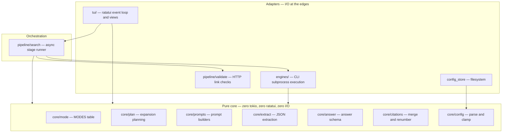
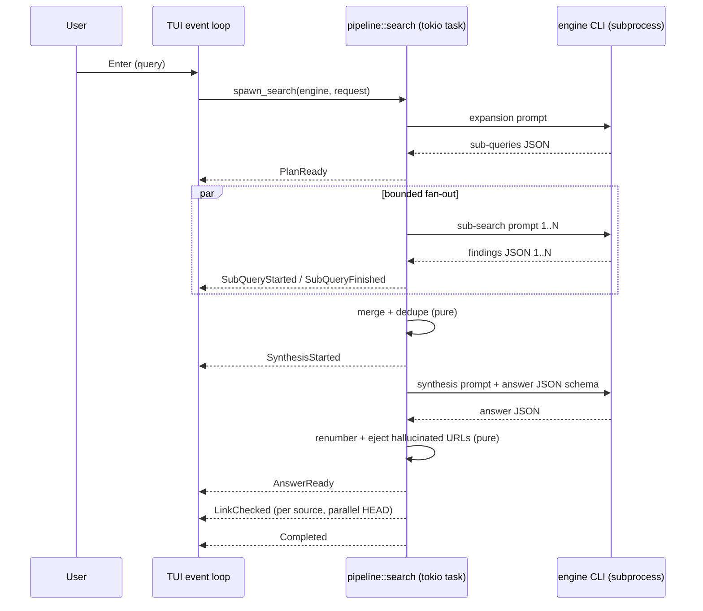

# Architecture

faro is a single binary crate with a `lib.rs`, structured hexagonally: a pure
functional core surrounded by thin adapters for subprocesses, HTTP, and the
terminal.

## Layers



## Purity rules

- `src/core/` imports neither `tokio` nor `ratatui` nor performs any I/O. Every
  function is deterministic: same inputs, same outputs.
- Adapters are thin. `engines/cli.rs` spawns processes; `pipeline/validate.rs`
  makes HTTP requests; `tui/` draws. Each delegates every decision to core
  functions.
- The TUI reducer (`tui/update.rs`) is a pure state machine: it receives an
  `AppEvent`, mutates `App`, and returns an optional `Command`. All side effects
  (spawning searches, opening URLs, saving config) are executed by the event loop
  in `tui/mod.rs`.

## Table-driven dispatch

Behavior is data wherever possible. Adding a row changes behavior; no branching
logic needs to be touched:

| Table | Location | Drives |
|---|---|---|
| `MODES` | `core/mode.rs` | search modes, breadth, prompt instructions |
| `ENGINES` | `engines/mod.rs` | engine binaries, argv, parse strategy |
| `EXTRACTORS` | `core/extract.rs` | JSON extraction strategies, tried in order |
| `KEYMAP` | `tui/keymap.rs` | keybindings, and the Ctrl+G help screen |
| `CONFIG_FIELDS` | `tui/app.rs` | config modal fields |
| `FRAMES` | `tui/widgets/spinner.rs` | spinner animation |
| `GENERIC_TEXT_KEYS` | `engines/parse.rs` | envelope key probing |
| fallback facet tables | `core/plan.rs` | offline query expansion |

## Data flow of one search



Communication is one-way: the pipeline task emits `SearchEvent`s over an mpsc
channel; the TUI folds them into `App` state via the reducer. Cancellation drops
the `SearchHandle`, which aborts the task; `kill_on_drop(true)` reaps any child
CLI processes.

## Module map

```
src/
├── main.rs           clap CLI, headless --print mode, TUI launch
├── lib.rs            public modules (integration tests build against this)
├── config_store.rs   config file resolution and persistence (FARO_CONFIG, XDG)
├── history_store.rs  search history file: append, load, clear (FARO_HISTORY, XDG state)
├── core/             pure: mode, plan, prompts, extract, answer, citations, config, history
├── engines/          EngineSpec table, Engine trait, CliEngine, output parsing
├── pipeline/         SearchEvent protocol, stage orchestration, link validation
└── tui/              App state, reducer, keymap, theme, views, widgets
```
